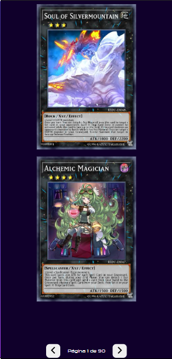
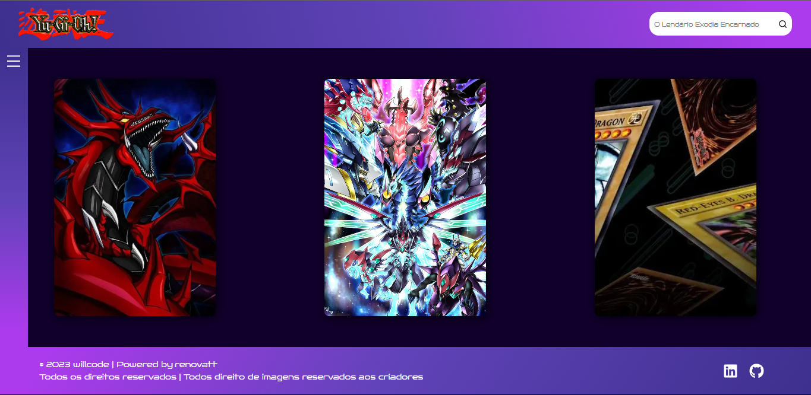
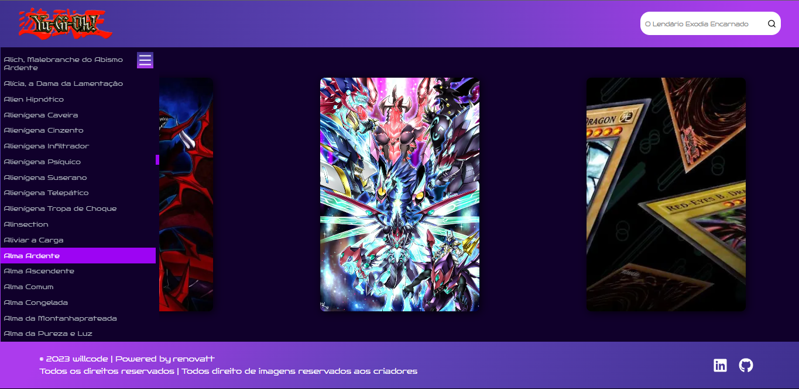

#

<h1>Yu-Gi-Oh   

Informações das cartas

</h1>

## Descrição

[Ver Projeto](yu-gi-oh-cards-renovatt.vercel.app)

#### Uma versão melhorada de um dos meus primeiros projetos, feito para fãs do anime e do jogo. Mostrando um pouco da minha evolução, de algo que parecia simples mas foi num projeto como este que aprendi bastante coisa sobre consumos de API's.

#

#

## _Layout Mobile_

#

## _Layout Web_

#

#

#

## 🛠️ Tecnologias

💻 **Front-end**
- [Next.js](https://nextjs.org)
- [TypeScript](https://www.typescriptlang.org)
- [Yu-Gi-Oh API](https://ygoprodeck.com/api-guide)

🎨 **Estilização**
- [Styled-Components](https://styled-components.com)

🔋 **Versionamento e Deploy**
- [Git](https://git-scm.com)
- [Vercel](https://vercel.com/)

 

⚙️ **Configuranções e Instalações**

Clone do Projeto

    $ git clone https://github.com/renovatt/yu-gi-oh.git

Instalando as dependências

    $ npm install

Iniciando o projeto

    $ npm run dev

 

**Como contribuir?**

- Você pode dar suporte me seguindo aqui no GitHub
- Dando uma estrela no projeto
- Criar uma conexão comigo no linkedin fazendo parte da minha networking e curtir o meu projeto.

 

**Autor**
[Wildemberg Renovato de Lima](https://www.linkedin.com/in/renovatt/)